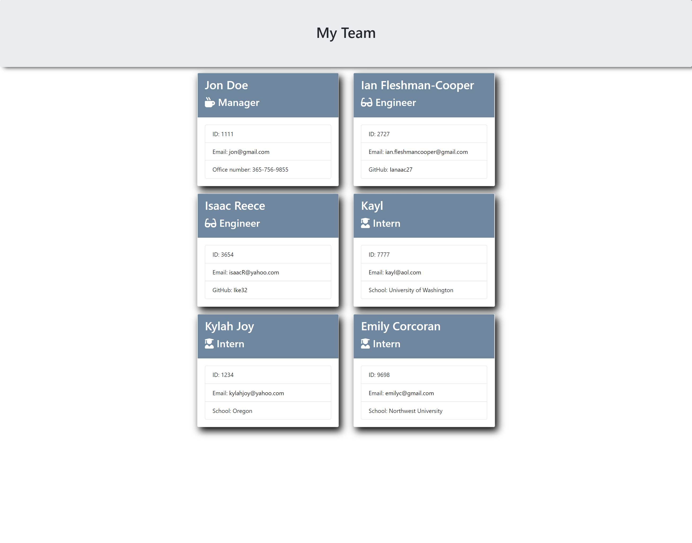

# Employee_Team_Summary

## Description

Need to pull a quick summary for all your team members? This application generates a responsive HTML page that displays all of the team members on your development team along with their roles and contact information. This is processed through npm "Inquirer" in which gives the user a set of prompts that helps provide information for all members of the team. This project demonstrates my skillset in JavaScript, Node.JS, npm "Inquirer", as well as unit testing through Jest. I have also utluized some of my CSS skills to bring more style and responsivness to the generated page. 

## Table of Contents

* [License](#license)
* [Contributing](#contributing)
* [Tests](#tests)
* [Screenshot](#screenshot)
* [Questions](#questions)

## License

MIT

## Contributing

Ianaac27

## Tests

## Screenshot

## Questions

If you have any questions, please refer to my contact information below.

[GitHub: Ianaac27](https://www.github.com/Ianaac27)

Email: ian.fleshmancooper@gmail.com
